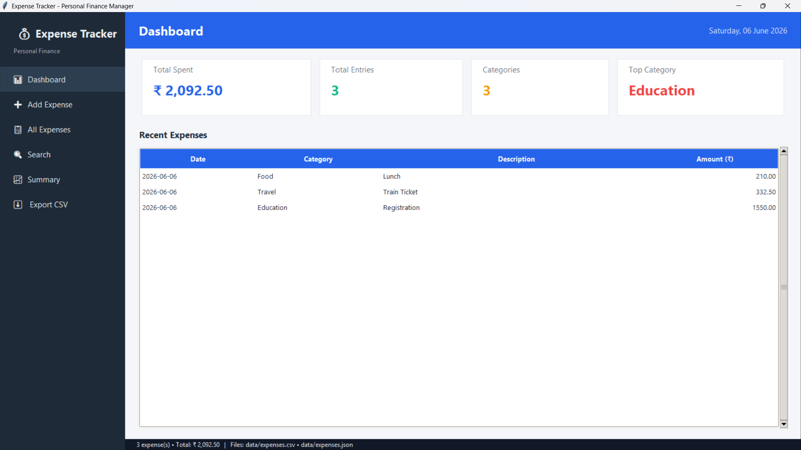
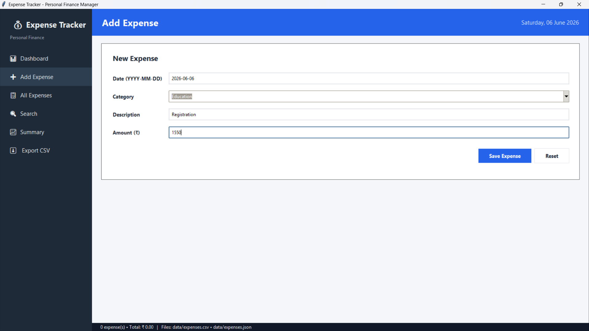
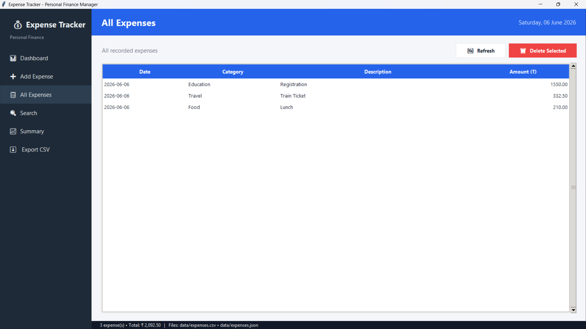
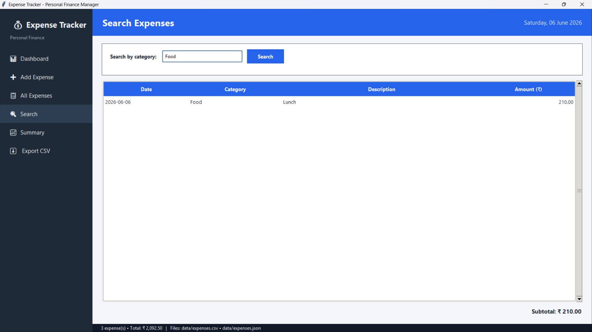
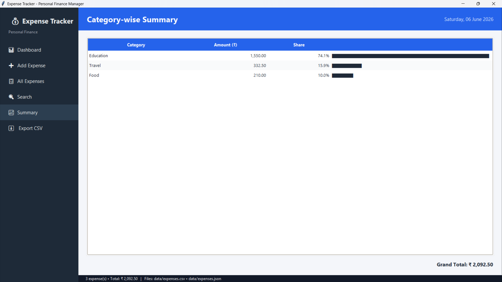

# 💰 Expense Tracker (CSV / JSON)

A modern desktop based Expense Tracker application built with Python and Tkinter. The application helps users record, organize, search, analyze, and export expense data through an intuitive dashboard interface while securely storing data in both CSV and JSON formats.


---

## 📖 Overview

Expense Tracker is a personal finance management desktop application designed to simplify expense tracking and spending analysis. Users can add, manage, search, and analyze expenses through a clean and professional interface.

The project demonstrates practical implementation of:

- Python GUI Development
- CSV & JSON Data Management
- File Handling & Data Persistence
- User Input Validation
- Expense Analysis & Reporting
- Dashboard Based Application Design
- Software Engineering Best Practices

---

## ✨ Features

### 📊 Dashboard

- Total Expense Overview
- Total Entries Count
- Categories Count
- Top Spending Category
- Recent Expenses Table

### 💵 Expense Management

- Add New Expenses
- View All Expenses
- Delete Existing Expenses
- Real Time Data Updates
- Input Validation

### 🔍 Search & Analysis

- Search Expenses by Category
- Category wise Summary
- Expense Statistics
- Spending Insights

### 💾 Data Management

- CSV Storage Support
- JSON Storage Support
- Automatic File Creation
- Export Data to CSV

### 🎨 User Interface

- Modern Sidebar Navigation
- Professional Dashboard Layout
- Responsive Tkinter Widgets
- Clean & User Friendly Design

---

## 🛠 Technologies Used

| Category | Technology |
|-----------|------------|
| Language | Python 3 |
| GUI Framework | Tkinter |
| Data Storage | CSV, JSON |
| Libraries | csv, json, os, tkinter, datetime |
| IDE | Visual Studio Code |
| Version Control | Git & GitHub |

---

## 📁 Project Structure

```text
Expense-Tracker/
│
├── .gitignore
├── main.py
├── README.md
├── requirements.txt
│
├── assets/
│   └── icons/
│
├── data/
│   ├── expenses.csv
│   └── expenses.json
│
├── documentation/
│   ├── PROJECT_DOC.md
│   └── USER_MANUAL.md
│
└── screenshots/
    ├── dashboard.png
    ├── add_expense.png
    ├── all_expenses.png
    ├── search.png
    └── summary.png
```

---

## 🚀 Installation

### Clone Repository

```bash
git clone https://github.com/santoshbehera01/Expense-Tracker.git
cd Expense-Tracker
```

### Run Application

```bash
python main.py
```

No additional third-party libraries are required.

---

## ▶️ Usage

### Add Expense

1. Open the application.
2. Navigate to **Add Expense**.
3. Enter Date, Category, Description, and Amount.
4. Click **Save Expense**.

### View Expenses

1. Navigate to **All Expenses**.
2. Browse all stored records.
3. Delete selected records when required.

### Search Expenses

1. Open **Search**.
2. Enter a category name.
3. View matching expense records instantly.

### Analyze Spending

1. Open **Summary**.
2. Review category wise spending.
3. Analyze overall expense trends.

### Export Data

1. Open **Export CSV**.
2. Select a destination.
3. Save a copy of your expense records.

---

## 🖼 Screenshots

### Dashboard



### Add Expense



### All Expenses



### Search



### Summary



---

## 📚 Documentation

Detailed project documentation is available in:

```text
documentation/
├── PROJECT_DOC.md
└── USER_MANUAL.md
```

Documentation includes:

- Project Architecture
- Application Workflow
- UI Design Decisions
- Feature Explanations
- User Guide
- Troubleshooting Guide

---

## 💽 Data Storage

The application stores data in:

### CSV File

```text
data/expenses.csv
```

### JSON File

```text
data/expenses.json
```

Both files are automatically created during the first application launch.

---

## 🎯 Learning Outcomes

This project demonstrates:

- Python Programming
- GUI Application Development
- File Handling
- CSV & JSON Processing
- Data Persistence
- Input Validation
- Modular Programming
- Software Documentation
- Git & GitHub Workflow

---

## 🔮 Future Enhancements

- Monthly Budget Management
- Expense Charts & Visual Analytics
- PDF Export
- Excel Export
- Date Range Filters
- Dark Mode
- Cloud Backup
- User Authentication

---

## 👨‍💻 Author

**Santosh Kumar Behera**

- 👨‍💻 B.Tech Computer Science & Engineering student  
- 💡 Interested in **Software Development & Problem Solving**

---

## 📄 License

This project is released under the MIT License and is intended for learning, personal use, and portfolio demonstration purposes..